# DeepFace System Architecture

## High-Level System Architecture

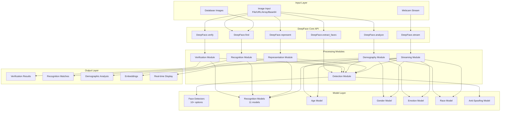

## Detailed Processing Pipeline

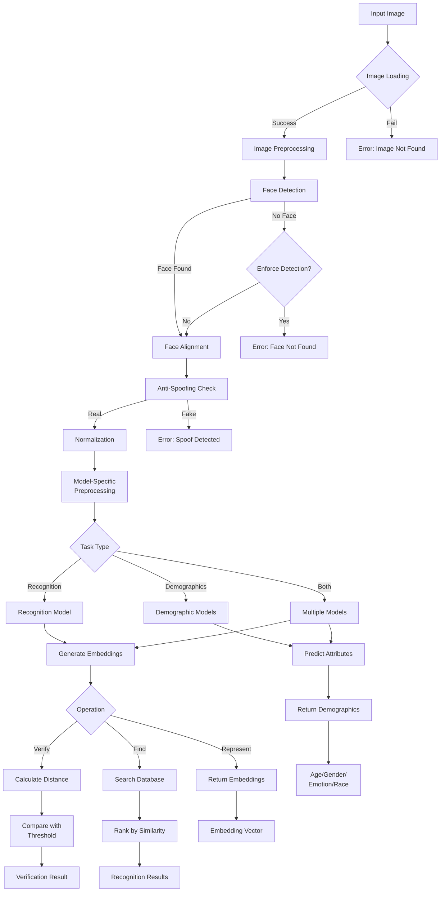

## Module Architecture

```mermaid
graph LR
    subgraph "deepface Package"
        A[DeepFace.py<br/>Main API]
        
        subgraph "modules/"
            B[detection.py]
            C[verification.py]
            D[recognition.py]
            E[representation.py]
            F[demography.py]
            G[streaming.py]
            H[modeling.py]
            I[preprocessing.py]
            J[normalization.py]
        end
        
        subgraph "models/"
            K[FacialRecognition]
            L[Detector]
            M[Demography]
            
            subgraph "facial_recognition/"
                N[VGGFace]
                O[Facenet]
                P[ArcFace]
                Q[DeepFace]
                R[OpenFace]
                S[DeepID]
                T[Dlib]
                U[SFace]
                V[GhostFaceNet]
                W[Buffalo_L]
            end
            
            subgraph "face_detection/"
                X[OpenCv]
                Y[Ssd]
                Z[Dlib]
                AA[MtCnn]
                AB[RetinaFace]
                AC[MediaPipe]
                AD[Yolo]
                AE[YuNet]
                AF[CenterFace]
            end
            
            subgraph "demography/"
                AG[Age]
                AH[Gender]
                AI[Emotion]
                AJ[Race]
            end
            
            subgraph "spoofing/"
                AK[FasNet]
            end
        end
        
        subgraph "commons/"
            AL[image_utils]
            AM[logger]
            AN[weight_utils]
            AO[folder_utils]
        end
        
        subgraph "config/"
            AP[threshold]
            AQ[confidence]
        end
        
        subgraph "database/"
            AR[postgres]
            AS[mongo]
            AT[weaviate]
        end
    end
    
    A --> B & C & D & E & F & G
    B & C & D & E & F & G --> H & I & J
    H --> K & L & M
    K --> N & O & P & Q & R & S & T & U & V & W
    L --> X & Y & Z & AA & AB & AC & AD & AE & AF
    M --> AG & AH & AI & AJ
    B --> AK
    B & C & D & E & F --> AL & AM & AP & AQ
    H --> AN & AO
    D --> AR & AS & AT
```

## Face Recognition Model Architecture

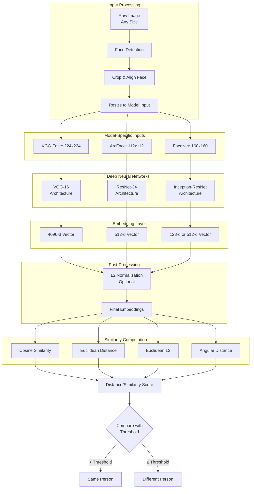

## Face Detection Pipeline

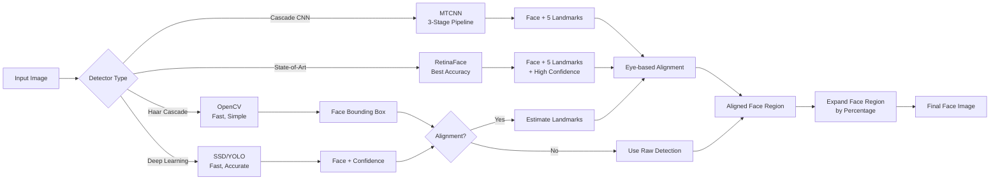

## Database Search Architecture

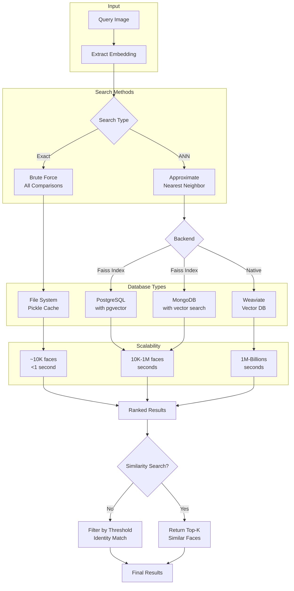

## Real-Time Streaming Architecture

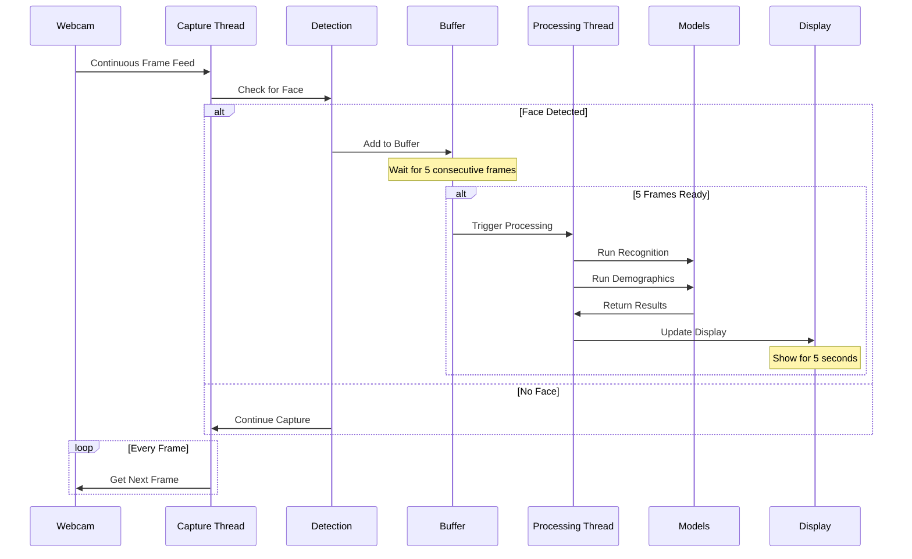

## Data Flow for Verification

```mermaid
graph LR
    A[Image 1] --> B[Detect Face 1]
    C[Image 2] --> D[Detect Face 2]
    
    B --> E[Align Face 1]
    D --> F[Align Face 2]
    
    E --> G[Preprocess 1]
    F --> H[Preprocess 2]
    
    G --> I[Recognition Model]
    H --> I
    
    I --> J[Embedding 1<br/>512-d vector]
    I --> K[Embedding 2<br/>512-d vector]
    
    J & K --> L[Calculate Distance]
    
    L --> M{Distance Metric}
    M -->|Cosine| N[cos(θ)]
    M -->|Euclidean| O[||e1-e2||]
    M -->|Euclidean L2| P[||e1-e2||₂]
    
    N & O & P --> Q[Distance Value]
    
    Q --> R{< Threshold?}
    R -->|Yes| S[Same Person<br/>verified: true]
    R -->|No| T[Different Person<br/>verified: false]
    
    S & T --> U[Return JSON Result]
```

## Multi-Face Processing

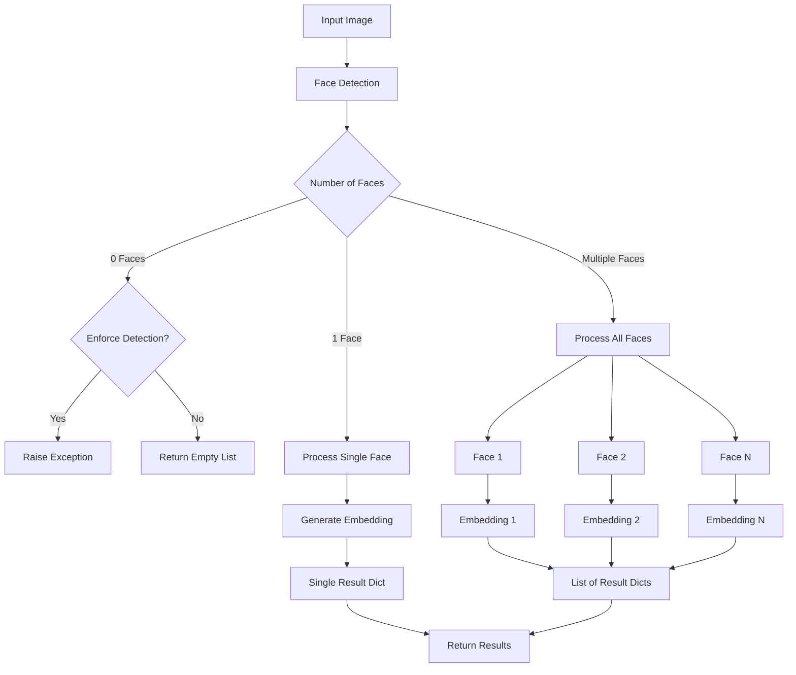

## Security Features

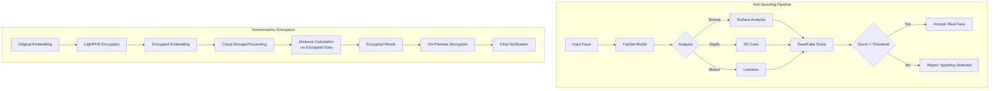

## API Service Architecture

```mermaid
graph TB
    subgraph "Client Layer"
        A[Web Browser]
        B[Mobile App]
        C[Desktop App]
        D[curl/Postman]
    end
    
    subgraph "API Gateway"
        E[Flask REST API<br/>Port 5005]
        F[CORS Middleware]
    end
    
    subgraph "API Routes"
        G[/verify]
        H[/find]
        I[/analyze]
        J[/represent]
        K[/register]
        L[/search]
    end
    
    subgraph "Core Services"
        M[DeepFace Core]
        N[Model Manager]
        O[Database Manager]
    end
    
    subgraph "Storage"
        P[File System]
        Q[PostgreSQL]
        R[MongoDB]
        S[Weaviate]
    end
    
    A & B & C & D --> E
    E --> F
    F --> G & H & I & J & K & L
    G & H & I & J --> M
    K & L --> O
    M --> N
    N --> P
    O --> Q & R & S
```

## Performance Optimization

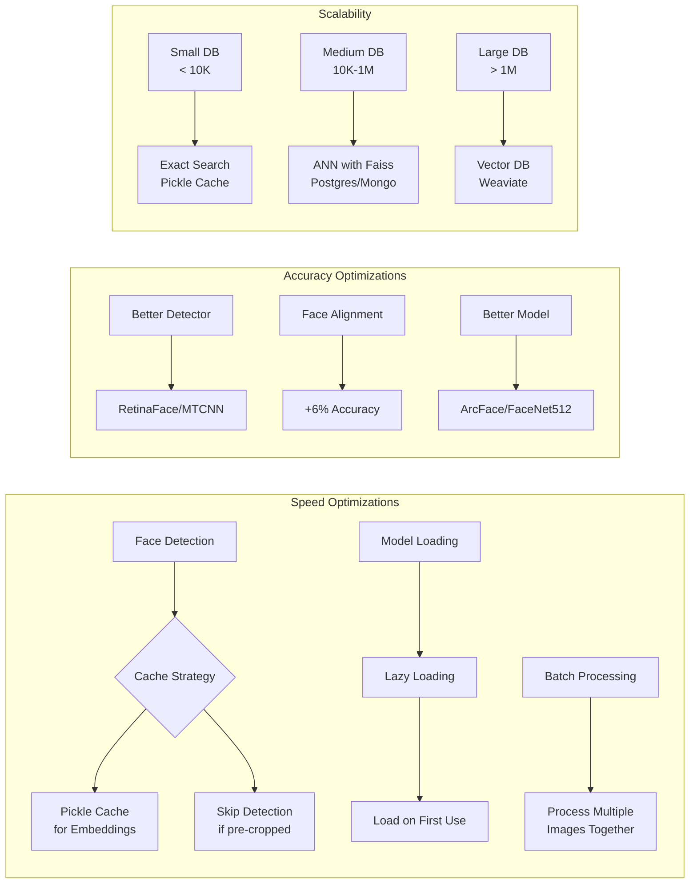

## Key Design Patterns

1. **Strategy Pattern**: Multiple interchangeable models for each task
2. **Factory Pattern**: Model creation and loading
3. **Facade Pattern**: Simple API hiding complex operations
4. **Cache Pattern**: Pickle files for embeddings
5. **Pipeline Pattern**: Sequential processing stages
6. **Observer Pattern**: Real-time streaming with callbacks

## Technology Stack

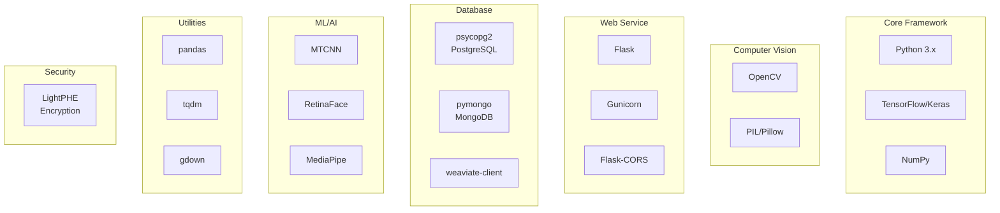

