# DeepFace Detailed Processing Pipeline

## Complete End-to-End Pipeline

This document provides an in-depth explanation of the DeepFace processing pipeline, including technical details, algorithms, and data transformations at each step.

---

## 1. Image Loading & Preprocessing

### 1.1 Input Handling

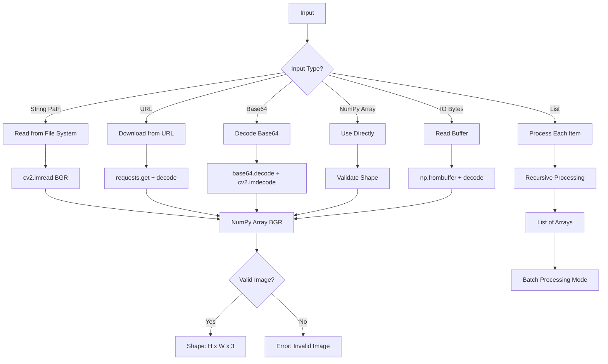

**Technical Details:**
- **Format**: Images loaded as NumPy arrays in BGR format (OpenCV convention)
- **Data Type**: uint8 (0-255 range)
- **Shape**: (height, width, 3)
- **Color Channels**: Blue, Green, Red (BGR order)

### 1.2 Image Validation

```python
# Validation checks performed:
1. Image is not None
2. Image has 3 dimensions (H, W, C)
3. Channels = 3 (RGB/BGR)
4. Non-zero dimensions
5. Valid data type (uint8 or float)
```

---

## 2. Face Detection Stage

### 2.1 Detector Selection & Initialization

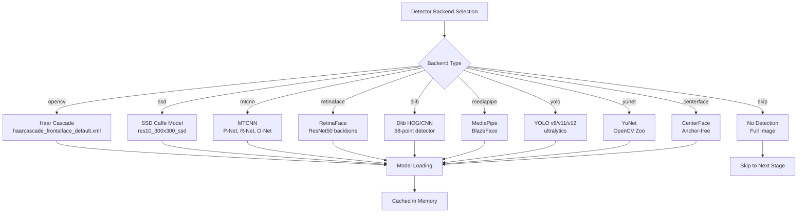

### 2.2 Detection Process (Example: RetinaFace)

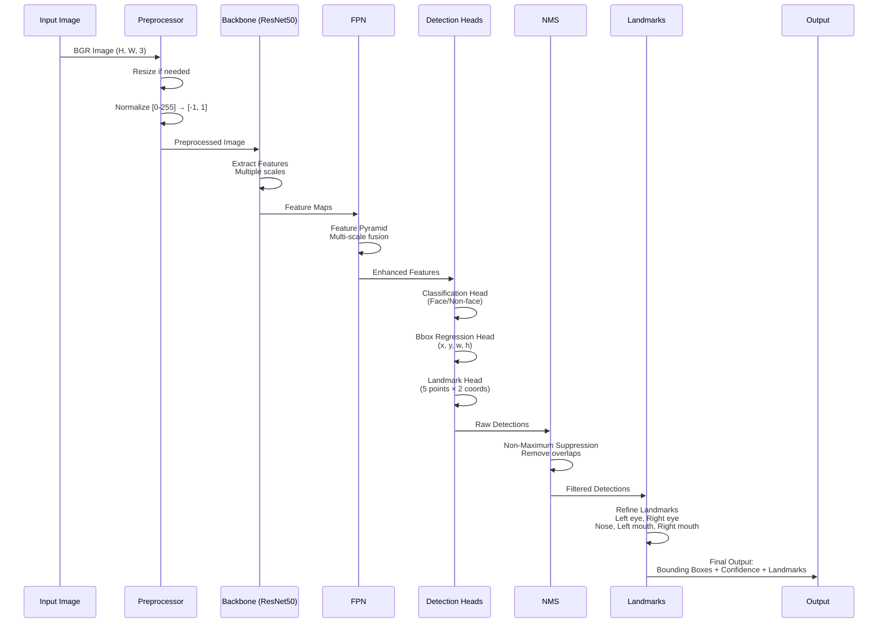

**Output Format:**
```python
{
    'facial_area': {'x': 100, 'y': 150, 'w': 120, 'h': 140},
    'confidence': 0.99,
    'landmarks': {
        'left_eye': (120, 180),
        'right_eye': (180, 180),
        'nose': (150, 210),
        'mouth_left': (130, 240),
        'mouth_right': (170, 240)
    }
}
```

### 2.3 Multi-Face Detection

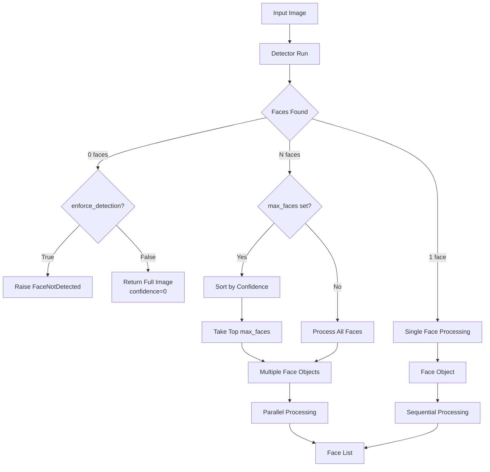

### 2.4 Detection Algorithms Comparison

| Detector | Algorithm | Speed | Accuracy | Landmarks | Best Use Case |
|----------|-----------|-------|----------|-----------|---------------|
| **OpenCV** | Haar Cascades | ⚡⚡⚡⚡⚡ | ⭐⭐ | ❌ | Real-time, frontal faces |
| **SSD** | Single Shot Detector | ⚡⚡⚡⚡ | ⭐⭐⭐ | ❌ | Fast general detection |
| **Dlib (HOG)** | HOG + SVM | ⚡⚡⚡ | ⭐⭐⭐ | ✅ 68 pts | Good balance |
| **MTCNN** | 3-Stage Cascade | ⚡⚡ | ⭐⭐⭐⭐ | ✅ 5 pts | High accuracy needed |
| **RetinaFace** | ResNet + FPN | ⚡⚡ | ⭐⭐⭐⭐⭐ | ✅ 5 pts | Best accuracy, crowds |
| **MediaPipe** | BlazeFace | ⚡⚡⚡⚡ | ⭐⭐⭐ | ✅ 6 pts | Mobile/Edge devices |
| **YOLO** | Anchor-based CNN | ⚡⚡⚡⚡ | ⭐⭐⭐⭐ | ❌ | Real-time video |
| **YuNet** | Lightweight CNN | ⚡⚡⚡⚡⚡ | ⭐⭐⭐ | ✅ 5 pts | Resource constrained |

---

## 3. Face Alignment Stage

### 3.1 Landmark-Based Alignment

```mermaid
flowchart TD
    A[Detected Face + Landmarks] --> B{Alignment Enabled?}
    B -->|No| C[Use Raw Detection]
    
    B -->|Yes| D{Landmarks Available?}
    D -->|No| E[Estimate from Bbox]
    D -->|Yes| F[Use Detected Landmarks]
    
    E & F --> G[Get Eye Positions]
    G --> H[Calculate Eye Center]
    H --> I[Calculate Angle]
    
    I --> J[Compute Rotation Angle<br/>θ = atan2(dy, dx)]
    
    J --> K[Build Transformation Matrix]
    
    K --> L[Rotation Matrix:<br/>cos(θ) -sin(θ) tx<br/>sin(θ)  cos(θ) ty<br/>0      0      1]
    
    L --> M[Apply Affine Transform<br/>cv2.warpAffine]
    
    M --> N[Aligned Face Image]
    
    N --> O[Accuracy Improvement:<br/>+6% on average]
```

**Mathematical Details:**

```python
# Calculate rotation angle
dx = right_eye_x - left_eye_x
dy = right_eye_y - left_eye_y
angle = np.degrees(np.arctan2(dy, dx))

# Calculate center point for rotation
center_x = (left_eye_x + right_eye_x) / 2
center_y = (left_eye_y + right_eye_y) / 2

# Build rotation matrix
M = cv2.getRotationMatrix2D((center_x, center_y), angle, scale=1.0)

# Adjust translation to keep face centered
M[0, 2] += (output_width / 2) - center_x
M[1, 2] += (output_height / 2) - center_y

# Apply transformation
aligned_face = cv2.warpAffine(img, M, (output_width, output_height))
```

### 3.2 Face Region Expansion

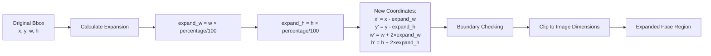

**Purpose**: Include more context (hair, neck) which can improve recognition

---

## 4. Face Normalization & Preprocessing

### 4.1 Resize to Model Input Size

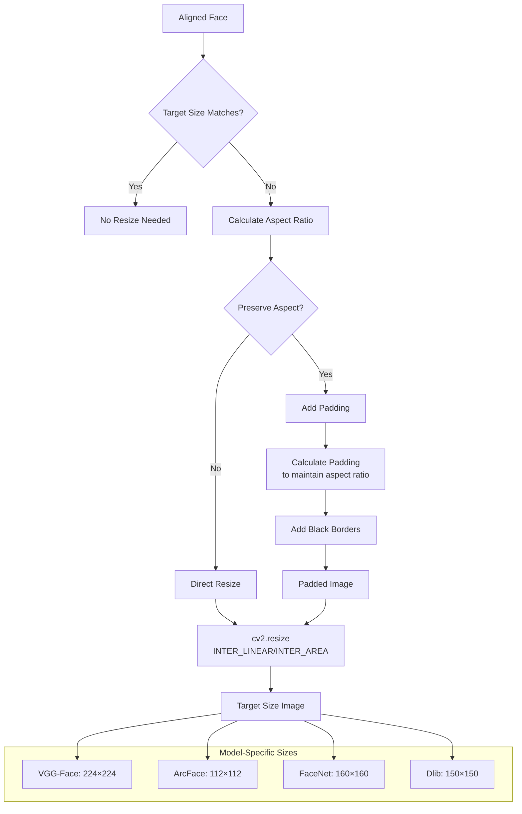

### 4.2 Normalization Methods

```mermaid
graph TB
    A[Resized Face Image<br/>uint8, 0-255] --> B{Normalization Method}
    
    B -->|base| C1[Divide by 255<br/>Range: 0-1]
    B -->|raw| C2[No normalization<br/>Range: 0-255]
    B -->|Facenet| C3[Standardize<br/>mean=127.5, std=128<br/>Range: -1 to 1]
    B -->|Facenet2018| C4[Per-channel mean<br/>ImageNet stats]
    B -->|VGGFace| C5[BGR mean subtraction<br/>mean=[93.59, 104.76, 129.18]]
    B -->|VGGFace2| C6[RGB mean subtraction<br/>+ scaling]
    B -->|ArcFace| C7[Mean=0.5, Std=0.5<br/>Range: -1 to 1]
    
    C1 & C2 & C3 & C4 & C5 & C6 & C7 --> D[Normalized Image]
    
    D --> E[Add Batch Dimension<br/>Shape: 1 × H × W × 3]
    
    E --> F[Ready for Model Input]
```

**Normalization Formulas:**

```python
# Base normalization
normalized = img / 255.0

# Facenet normalization
normalized = (img - 127.5) / 128.0

# VGGFace normalization
mean = [93.59, 104.76, 129.18]  # BGR order
normalized = img - mean

# ArcFace normalization
normalized = (img / 255.0 - 0.5) / 0.5
```

---

## 5. Feature Extraction (Deep Learning Models)

### 5.1 Model Architecture Examples

#### VGG-Face Architecture

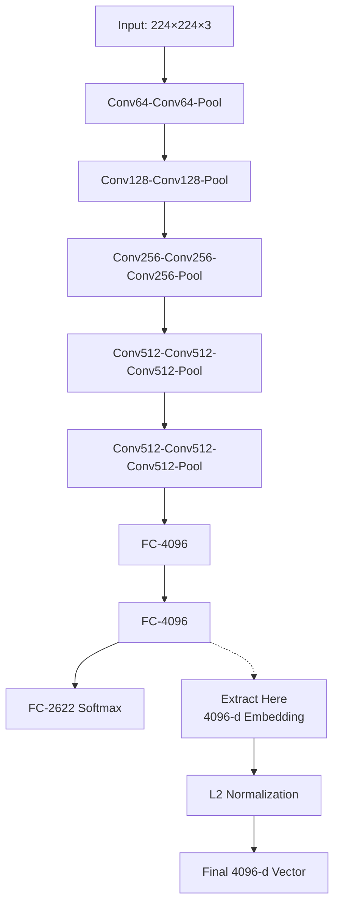

**Layer Details:**
- Total Parameters: ~145M
- Convolutional Layers: 13
- Fully Connected Layers: 3
- Activation: ReLU
- Training: 2.6M images, 2,622 identities

#### ArcFace (ResNet-34) Architecture

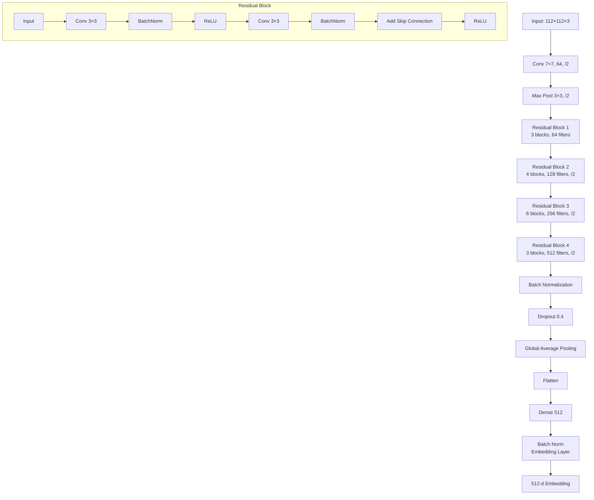

**Training Details:**
- Loss Function: ArcFace Loss (Additive Angular Margin)
- Formula: $L = -\log \frac{e^{s(\cos(\theta_{y_i} + m))}}{e^{s(\cos(\theta_{y_i} + m))} + \sum_{j \neq y_i} e^{s\cos\theta_j}}$
- Scale (s): 64
- Margin (m): 0.5
- Effect: Increases intra-class compactness, inter-class discrepancy

#### FaceNet (Inception-ResNet) Architecture

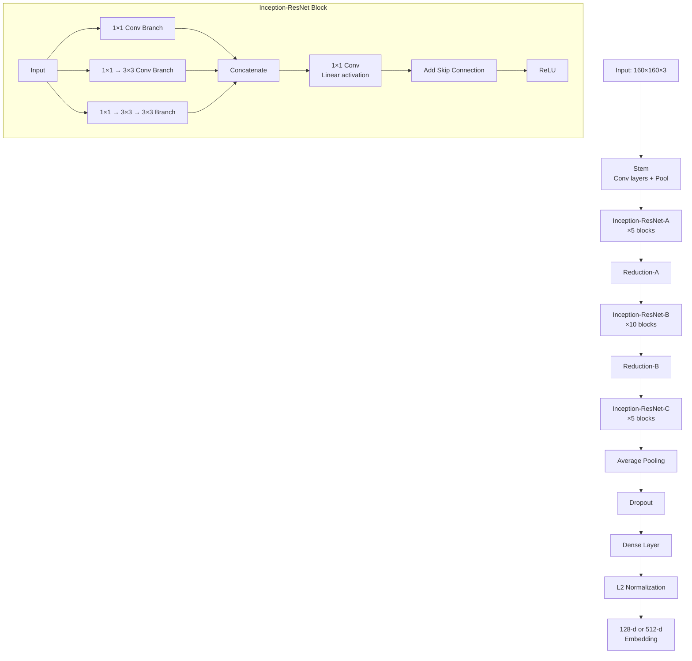

**Training Details:**
- Loss Function: Triplet Loss
- Formula: $L = \max(0, ||f(a) - f(p)||^2 - ||f(a) - f(n)||^2 + \alpha)$
- Triplet: Anchor, Positive (same person), Negative (different person)
- Margin (α): 0.2
- Mining: Hard triplet mining for efficiency

### 5.2 Forward Pass

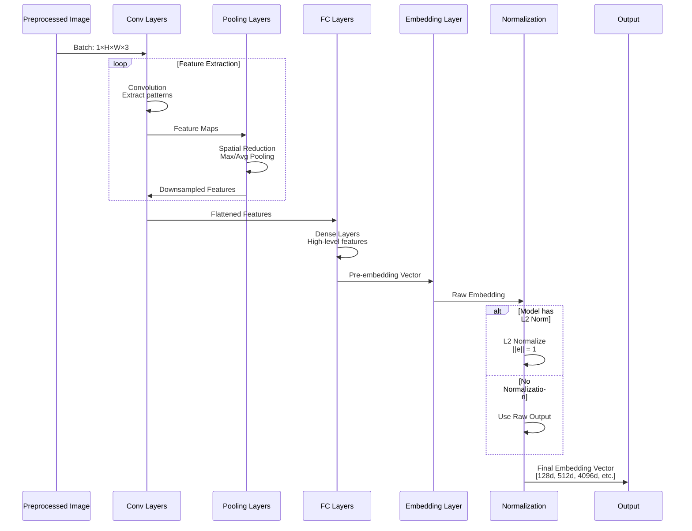

---

## 6. Anti-Spoofing (Optional)

### 6.1 FasNet Architecture

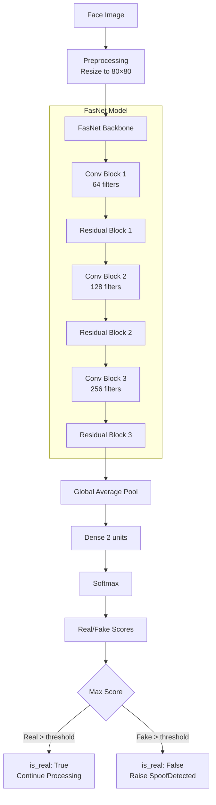

**Detection Mechanisms:**
1. **Texture Analysis**: Detect print artifacts, screen moiré patterns
2. **Depth Cues**: Analyze 3D structure vs flat surface
3. **Color Distribution**: Check natural skin tone variations
4. **Frequency Domain**: FFT analysis for unnatural patterns

---

## 7. Embedding Post-Processing

### 7.1 L2 Normalization

```mermaid
flowchart LR
    A[Raw Embedding<br/>e = e1, e2, ..., en] --> B[Calculate L2 Norm]
    
    B --> C[norm = √(e1² + e2² + ... + en²)]
    
    C --> D[Normalize Each Component]
    
    D --> E[e'i = ei / norm]
    
    E --> F[Unit Vector<br/>||e'|| = 1]
    
    F --> G[Benefits:<br/>- Removes magnitude<br/>- Keeps direction<br/>- Better similarity]
```

**Mathematical Formula:**
$$\mathbf{e'} = \frac{\mathbf{e}}{||\mathbf{e}||_2} = \frac{\mathbf{e}}{\sqrt{\sum_{i=1}^{n} e_i^2}}$$

### 7.2 Min-Max Normalization

```python
# Scale to [0, 1] range
embedding_min = np.min(embedding)
embedding_max = np.max(embedding)
normalized = (embedding - embedding_min) / (embedding_max - embedding_min)
```

---

## 8. Distance/Similarity Calculation

### 8.1 Distance Metrics

```mermaid
graph TB
    A[Embedding 1<br/>e1] --> E[Distance Calculation]
    B[Embedding 2<br/>e2] --> E
    
    E --> F{Metric Type}
    
    F -->|Cosine| G[Cosine Similarity<br/>cos θ = e1·e2 / ||e1||||e2||]
    F -->|Euclidean| H[Euclidean Distance<br/>d = √Σ e1i - e2i²]
    F -->|Euclidean L2| I[L2-Normalized Euclidean<br/>d = ||e1' - e2'||]
    F -->|Angular| J[Angular Distance<br/>θ = arccos(e1·e2) / π]
    
    G --> K[Range: -1 to 1<br/>Higher = More Similar]
    H --> L[Range: 0 to ∞<br/>Lower = More Similar]
    I --> M[Range: 0 to 2<br/>Lower = More Similar]
    J --> N[Range: 0 to 1<br/>Lower = More Similar]
    
    K & L & M & N --> O[Distance/Similarity Score]
```

### 8.2 Detailed Metric Calculations

#### Cosine Similarity
```python
def cosine_distance(embedding1, embedding2):
    # Dot product
    dot_product = np.dot(embedding1, embedding2)
    
    # L2 norms
    norm1 = np.linalg.norm(embedding1)
    norm2 = np.linalg.norm(embedding2)
    
    # Cosine similarity
    cosine_sim = dot_product / (norm1 * norm2)
    
    # Convert to distance (0 = identical, 2 = opposite)
    distance = 1 - cosine_sim
    
    return distance
```

**Range Interpretation:**
- 0.0: Identical faces (perfect match)
- 0.0-0.4: Same person (highly likely)
- 0.4-0.6: Uncertain (boundary)
- 0.6-1.0: Different person (likely)
- 1.0+: Very different (opposite direction)

#### Euclidean Distance
```python
def euclidean_distance(embedding1, embedding2):
    # Calculate squared differences
    diff = embedding1 - embedding2
    squared_diff = diff ** 2
    
    # Sum and square root
    distance = np.sqrt(np.sum(squared_diff))
    
    return distance
```

#### Euclidean L2 (Normalized)
```python
def euclidean_l2_distance(embedding1, embedding2):
    # L2 normalize both embeddings
    e1_norm = embedding1 / np.linalg.norm(embedding1)
    e2_norm = embedding2 / np.linalg.norm(embedding2)
    
    # Calculate euclidean distance
    distance = np.sqrt(np.sum((e1_norm - e2_norm) ** 2))
    
    return distance
```

**Maximum possible distance:** 2.0 (when vectors point in opposite directions)

---

## 9. Threshold Comparison

### 9.1 Threshold Selection

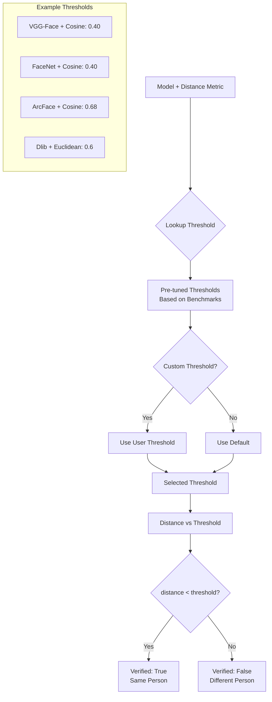

### 9.2 Confidence Score Calculation

```python
def calculate_confidence(distance, threshold, metric='cosine'):
    if metric == 'cosine':
        # Higher similarity = higher confidence
        # Convert distance to similarity: similarity = 1 - distance
        similarity = 1 - distance
        max_similarity = 1.0
        
        # Confidence based on how far above threshold
        threshold_similarity = 1 - threshold
        
        if similarity >= threshold_similarity:
            # Positive match confidence
            confidence = (similarity - threshold_similarity) / (max_similarity - threshold_similarity)
        else:
            # Negative match confidence
            confidence = (threshold_similarity - similarity) / threshold_similarity
            confidence = -confidence  # Negative to indicate non-match
    
    return confidence
```

---

## 10. Verification Result

### 10.1 Output Structure

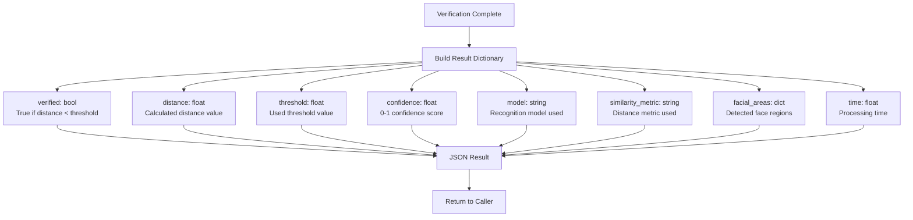

**Example Output:**
```json
{
    "verified": true,
    "distance": 0.3245,
    "threshold": 0.40,
    "confidence": 0.8134,
    "model": "VGG-Face",
    "similarity_metric": "cosine",
    "detector_backend": "retinaface",
    "facial_areas": {
        "img1": {"x": 100, "y": 150, "w": 120, "h": 140, "confidence": 0.99},
        "img2": {"x": 95, "y": 145, "w": 125, "h": 145, "confidence": 0.98}
    },
    "time": 0.432
}
```

---

## 11. Database Search Pipeline (Find Function)

### 11.1 Database Preparation

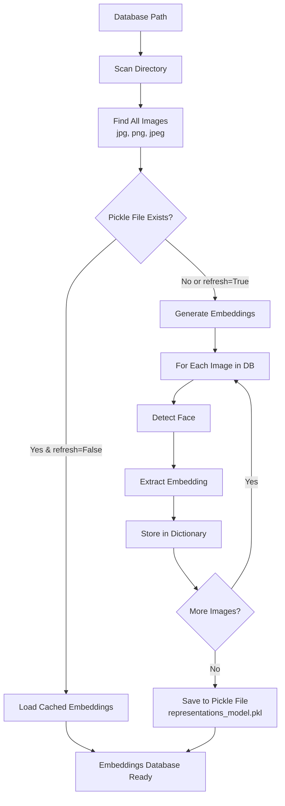

### 11.2 Search Process

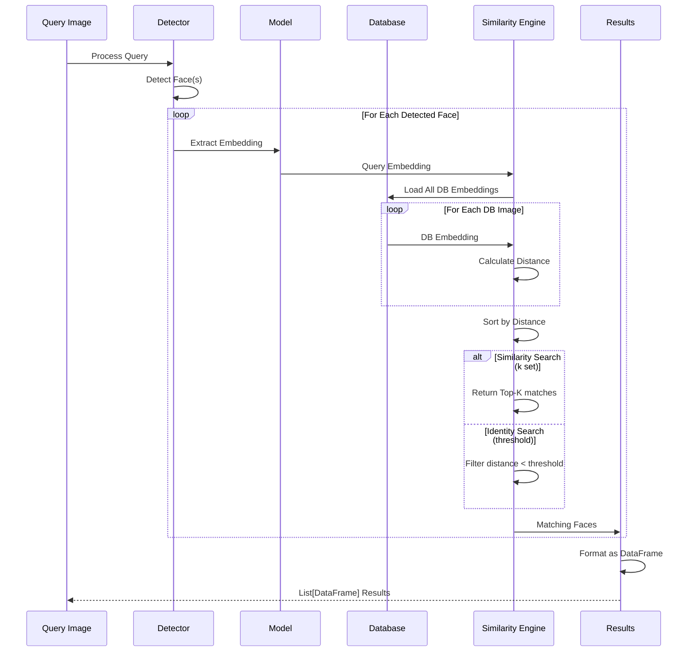

### 11.3 Distance Matrix Calculation

```python
# Optimized vectorized distance calculation
def find_matches_vectorized(query_embedding, db_embeddings, metric='cosine'):
    if metric == 'cosine':
        # Normalize embeddings
        query_norm = query_embedding / np.linalg.norm(query_embedding)
        db_norms = db_embeddings / np.linalg.norm(db_embeddings, axis=1, keepdims=True)
        
        # Dot product for all at once
        similarities = np.dot(db_norms, query_norm)
        distances = 1 - similarities
        
    elif metric == 'euclidean':
        # Broadcasting for efficient calculation
        diff = db_embeddings - query_embedding
        distances = np.sqrt(np.sum(diff ** 2, axis=1))
    
    return distances
```

---

## 12. Demographic Analysis Pipeline

### 12.1 Multi-Task Analysis

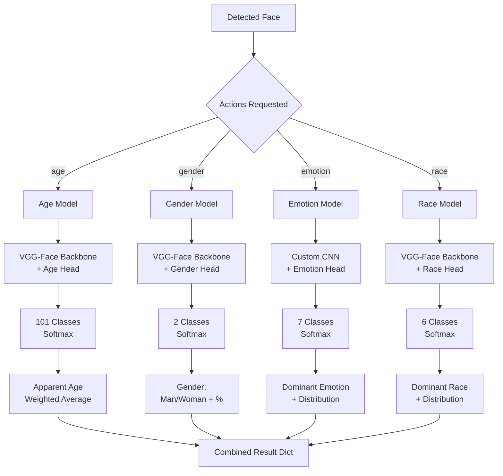

### 12.2 Age Prediction Detail

```mermaid
flowchart TD
    A[Face Image 224×224] --> B[VGG-Face Feature Extractor]
    B --> C[4096-d Features]
    C --> D[1×1 Conv, 101 filters]
    D --> E[Flatten]
    E --> F[Softmax 101 outputs]
    
    F --> G[Probability Distribution<br/>P age=0 ... P age=100]
    
    G --> H[Calculate Apparent Age]
    H --> I[age = Σ i × P i<br/>i=0 to 100]
    
    I --> J[Apparent Age Value<br/>e.g., 27.4 years]
    
    subgraph "Output"
        K[age: 27<br/>age_confidence: 0.64]
    end
    
    J --> K
```

**Calculation Example:**
```python
# Age predictions (101 probabilities)
age_probs = [0.001, 0.002, ..., 0.034, 0.087, 0.124, 0.091, ..., 0.001]

# Apparent age = weighted average
apparent_age = sum(age * prob for age, prob in enumerate(age_probs))

# Confidence = max probability
age_confidence = max(age_probs)
```

### 12.3 Emotion Recognition

```python
EMOTION_LABELS = ['angry', 'disgust', 'fear', 'happy', 'sad', 'surprise', 'neutral']

# Model output: 7 probabilities
emotion_probs = [0.02, 0.01, 0.03, 0.78, 0.05, 0.08, 0.03]

# Dominant emotion
dominant_idx = np.argmax(emotion_probs)
dominant_emotion = EMOTION_LABELS[dominant_idx]  # 'happy'

# Return all scores
result = {
    'emotion': {
        'angry': 2.1,
        'disgust': 1.3,
        'fear': 3.2,
        'happy': 78.4,  # Dominant
        'sad': 5.1,
        'surprise': 7.6,
        'neutral': 2.3
    },
    'dominant_emotion': 'happy'
}
```

---

## 13. Real-Time Streaming Pipeline

### 13.1 Frame Processing Loop

```mermaid
sequenceDiagram
    participant W as Webcam
    participant C as Capture Thread
    participant B as Frame Buffer
    participant F as Face Tracker
    participant P as Processor
    participant M as Models
    participant UI as Display
    participant T as Timer
    
    loop Continuous
        W->>C: Read Frame
        C->>F: Check Face
        
        alt Face Detected
            F->>F: Increment Counter
            F->>B: Add to Buffer
            
            alt Counter >= 5
                B->>P: Trigger Analysis
                P->>T: Start Timer
                
                par Parallel Analysis
                    P->>M: Recognition
                and
                    P->>M: Age/Gender
                and
                    P->>M: Emotion
                and
                    P->>M: Race
                end
                
                M->>P: All Results
                P->>UI: Update Display
                T->>T: Wait 5 seconds
                T->>F: Reset Counter
            end
        else No Face
            F->>F: Reset Counter
            B->>B: Clear Buffer
        end
        
        C->>UI: Show Frame
    end
```

### 13.2 Buffer Management

```python
class FaceBuffer:
    def __init__(self, size=5):
        self.buffer = []
        self.size = size
        self.last_analysis_time = 0
        self.analysis_interval = 5  # seconds
    
    def add_frame(self, face_img):
        self.buffer.append(face_img)
        if len(self.buffer) > self.size:
            self.buffer.pop(0)
    
    def is_ready(self):
        return len(self.buffer) == self.size
    
    def should_analyze(self, current_time):
        return (current_time - self.last_analysis_time) > self.analysis_interval
    
    def get_best_frame(self):
        # Return middle frame or best quality
        return self.buffer[len(self.buffer) // 2]
```

---

## 14. Performance Optimizations

### 14.1 Lazy Model Loading

```mermaid
flowchart TD
    A[DeepFace Function Called] --> B{Model in Cache?}
    
    B -->|Yes| C[Use Cached Model]
    B -->|No| D[Load Model]
    
    D --> E[Download Weights<br/>if necessary]
    E --> F[Build Model Architecture]
    F --> G[Load Weights]
    G --> H[Store in Cache]
    
    H --> I[Model Ready]
    C --> I
    
    I --> J[Use for Inference]
    
    subgraph "Model Cache"
        K[model_cache = {}]
        L[Key: model_name + task]
        M[Value: loaded model]
    end
    
    H -.-> K
```

### 14.2 Batch Processing

```python
# Process multiple faces efficiently
def process_batch(face_images, model):
    # Stack into batch
    batch = np.stack(face_images, axis=0)  # Shape: (N, H, W, 3)
    
    # Single forward pass for all
    embeddings = model.predict(batch, verbose=0)  # Shape: (N, embed_dim)
    
    return embeddings

# 10x faster than processing one-by-one
```

### 14.3 Database Caching Strategy

```mermaid
graph TB
    A[DB Image Change] --> B{Refresh Strategy}
    
    B -->|Aggressive| C[Always Regenerate<br/>refresh=True]
    B -->|Conservative| D[Use Cache<br/>refresh=False]
    B -->|Smart| E[Check Modification Times]
    
    E --> F{Files Changed?}
    F -->|Yes| G[Regenerate Embeddings]
    F -->|No| H[Use Cached Pickle]
    
    C & G --> I[Full Processing<br/>Slower but Accurate]
    D & H --> J[Load from Pickle<br/>Fast but May Be Stale]
```

---

## 15. Error Handling & Edge Cases

### 15.1 Error Flow

```mermaid
flowchart TD
    A[Start Processing] --> B{Image Valid?}
    B -->|No| E1[ImgNotFound Exception]
    
    B -->|Yes| C{Face Detected?}
    C -->|No & enforce=True| E2[FaceNotDetected Exception]
    C -->|No & enforce=False| F[Use Full Image]
    
    C -->|Yes| D{Spoofing Check?}
    D -->|Failed| E3[SpoofDetected Exception]
    D -->|Passed or Skipped| G{Embeddings Valid?}
    
    G -->|Dimension Mismatch| E4[DimensionMismatchError]
    G -->|Invalid Type| E5[DataTypeError]
    
    G -->|Valid| H[Continue Processing]
    
    E1 & E2 & E3 & E4 & E5 --> I[Raise Exception]
    F & H --> J[Return Results]
```

### 15.2 Graceful Degradation

```python
def robust_verification(img1, img2):
    try:
        # Try with best detector
        result = DeepFace.verify(
            img1, img2,
            detector_backend='retinaface',
            enforce_detection=True
        )
    except FaceNotDetected:
        # Fallback to faster detector
        try:
            result = DeepFace.verify(
                img1, img2,
                detector_backend='opencv',
                enforce_detection=True
            )
        except FaceNotDetected:
            # Last resort: no detection
            result = DeepFace.verify(
                img1, img2,
                detector_backend='skip',
                enforce_detection=False
            )
    
    return result
```

---

## 16. Complete Pipeline Timing

### Typical Processing Times (Single Image Pair)

```mermaid
gantt
    title Face Verification Pipeline Timing (ms)
    dateFormat X
    axisFormat %L
    
    section Loading
    Image Load           :0, 10
    
    section Detection
    OpenCV Detect        :10, 15
    RetinaFace Detect    :10, 50
    
    section Alignment
    Alignment            :done, 50, 55
    
    section Preprocessing
    Resize & Normalize   :55, 60
    
    section Recognition
    VGG-Face Forward     :60, 110
    FaceNet Forward      :60, 80
    ArcFace Forward      :60, 85
    
    section Comparison
    Distance Calc        :110, 112
    
    section Total
    Fast Pipeline        :0, 95
    Accurate Pipeline    :0, 165
```

**Breakdown:**
- **Fast (OpenCV + FaceNet)**: ~95ms
- **Balanced (MTCNN + ArcFace)**: ~140ms  
- **Accurate (RetinaFace + VGG-Face)**: ~165ms

---

## Summary

This pipeline demonstrates the sophisticated multi-stage processing that DeepFace performs:

1. **Flexible input handling** supporting multiple formats
2. **Advanced face detection** with 10+ algorithms
3. **Precise alignment** improving accuracy by 6%
4. **Model-specific preprocessing** for optimal performance
5. **State-of-the-art deep learning models** with >97% accuracy
6. **Multiple distance metrics** for similarity comparison
7. **Intelligent caching** for database search efficiency
8. **Real-time capabilities** with frame buffering
9. **Comprehensive error handling** with graceful degradation

The pipeline is designed to be both **powerful** (state-of-the-art accuracy) and **practical** (optimized performance, easy-to-use API).
